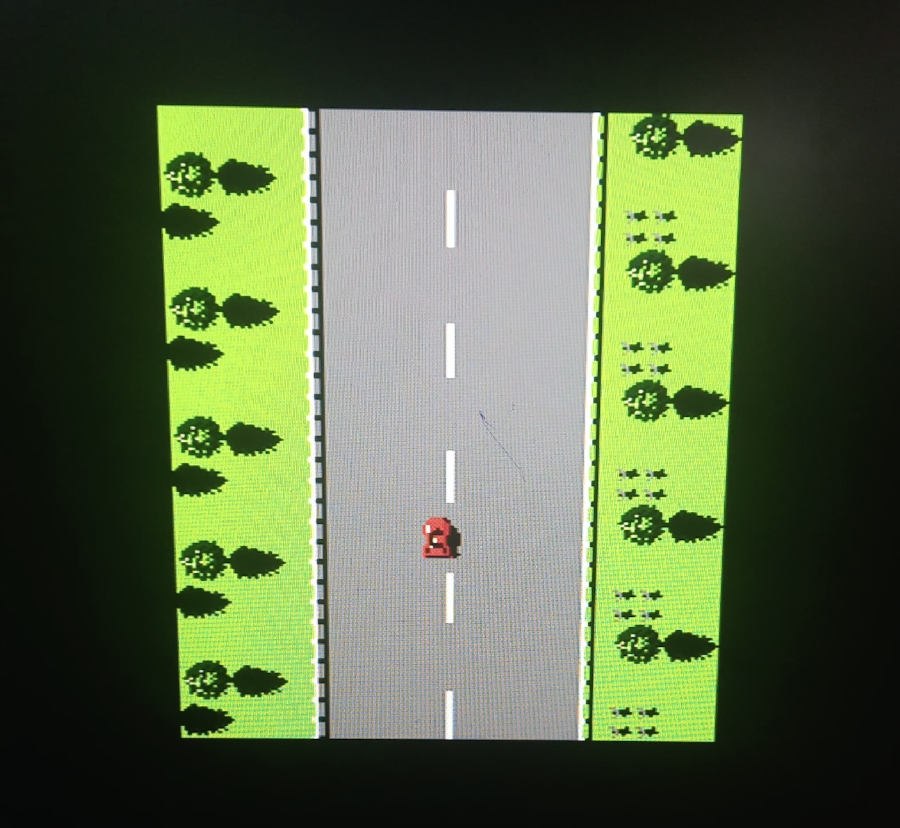
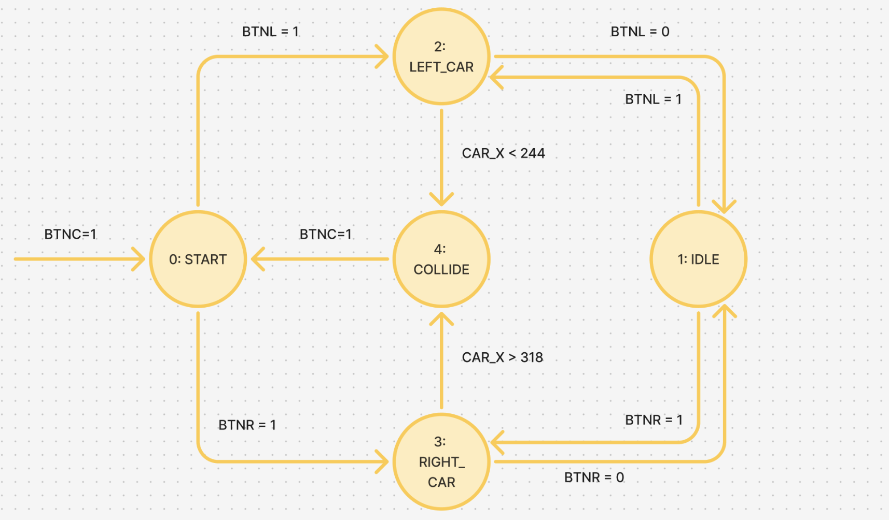

# FPGA-Based Arcade Racer: Road Fighter

A hardware-native implementation of the classic "Road Fighter" arcade game, built entirely in Verilog for the Xilinx Basys 3 FPGA board. This project features real-time VGA rendering, sprite-based graphics with transparency logic, and a collision-detection engine.

  

## 🛠 Features
* **Hardware Graphics Engine:** Custom VGA controller driving a 640x480 resolution at 60Hz.
* **Dynamic Sprite Rendering:** Real-time rendering of player and rival cars with hardware-level transparency (chroma-keying).
* **Collision Detection Engine:** Geometric hit-box logic implemented in combinational circuitry to detect road boundary violations and car-to-car impacts.
* **Procedural Content Generation:** Linear Feedback Shift Register (LFSR) used to generate pseudo-random spawn points for rival vehicles.
* **FSM Control Logic:** Robust Finite State Machine to handle game states: `START`, `IDLE`, `MOVE_LEFT`, `MOVE_RIGHT`, and `COLLIDE`.

## 📂 Project Structure
├── src/
│   ├── Display_sprite.v      # Main rendering engine 
│   ├── car_fsm.v             # Main Game Logic, FSM diagram given oater
│   ├── clk_divider.v         # makes larger clock to process everything
│   ├── vert_counter.v        # counts number of vertical ticks
│   ├── VGA_driver.v          # Communication through VGA channel to monitor
│   ├── Horiz_counter.v       # counts each horizontal tick
│   └── vert_counter.v        # counts number of vertical ticks
├── assets/
│   ├── bg_rom.coe            # Road and background pixel data (12-bit RGB)
│   ├── main_car.coe          # Player car sprite data
│   └── rival_car.coe         # Enemy vehicle sprite data
├── Extra/
│   ├── basys.xdc             # Physical pin mapping for VGA and buttons
│   └── testbench.v  
├── Images/
└── README.md

  

